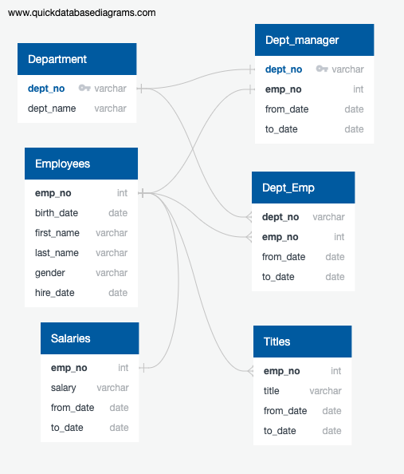

# Challenge7_Pewlett-Hackard-Analysis

In this module, we are helping Pewlett Hackard to determine the list of current eligible retiring employees, as well as the employees whose qualified for mentorship program. Pewlett Hackard company had provided six csv files as resources for analysis, and ERD diagram was created using online resources Quick DBD. ERD diagram is shown below with connections between tables.

## Summary
* 41380 current employees are eligible for retirement.
* 1549 current employees are available for mentorship program. 
* As a recommandation, retirement plan can be carry out by senority of the employee. 

## Challenge Overview
Overall, this analysis process is very smooth. One of the problem encouter is when importing csv file for titles, which the primary key needs to be unique identifiers instead of duplicated number. 

